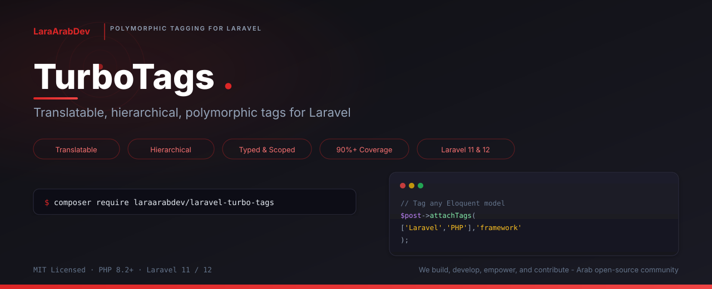

<p align="center">
    
</p>

<h1 align="center">TurboTags</h1>

<p align="center">
    <strong>Translatable, hierarchical, polymorphic tags for Laravel</strong>
</p>

<p align="center">
    <a href="https://packagist.org/packages/laraarabdev/laravel-turbo-tags"></a>
    <a href="https://packagist.org/packages/laraarabdev/laravel-turbo-tags"></a>
    <a href="https://packagist.org/packages/laraarabdev/laravel-turbo-tags"></a>
    <a href="https://packagist.org/packages/laraarabdev/laravel-turbo-tags"></a>
    <a href="https://laravel.com"></a>
</p>

<p align="center">
    <a href="https://github.com/LaraArabDev/LaravelTurboTags/actions/workflows/tests.yml"></a>
    <a href="https://codecov.io/gh/LaraArabDev/LaravelTurboTags"></a>
    <a href="https://github.com/LaraArabDev/LaravelTurboTags/actions/workflows/static-analysis.yml"></a>
    <a href="https://github.com/LaraArabDev/LaravelTurboTags/actions/workflows/security.yml"></a>
    <a href="https://github.com/LaraArabDev/LaravelTurboTags/actions/workflows/mutation-testing.yml"></a>
    <a href="https://github.com/LaraArabDev/LaravelTurboTags/actions/workflows/code-style.yml"></a>
</p>

<p align="center">
    Translatable, hierarchical, polymorphic tags for Laravel<br>
    PHP 8.2+ &middot; Laravel 11 / 12
</p>

<p align="center">
    <b><a href="https://github.com/LaraArabDev">LaraArabDev</a></b> — We build, develop, empower, and contribute. An Arab open-source community crafting production-grade Laravel packages.<br>
    <b><a href="https://github.com/LaraArabDev">LaraArabDev</a></b> — نبني، نطوّر، نُمكّن، ونُساهم. مجتمع عربي مفتوح المصدر يصنع حزم Laravel احترافية وجاهزة للإنتاج.
</p>

<p align="center">
    <a href="#quick-start">Quick Start</a> ·
    <a href="#features">Features</a> ·
    <a href="#usage">Usage</a> ·
    <a href="#configuration">Configuration</a> ·
    <a href="#testing">Testing</a> ·
    <a href="#changelog">Changelog</a>
</p>

---

## What is TurboTags?

**TurboTags** is a polymorphic tagging package for Laravel that lets you tag any Eloquent model with translatable, typed, hierarchical tags. It supports multilingual tag names via JSON columns, parent-child tag trees, automatic slug generation, tag types/categories, ownership scoping, query scopes, caching, and tag suggestions out of the box.

---

## Quick Start

```bash
composer require laraarabdev/laravel-turbo-tags
```

Publish the config and migrations:

```bash
php artisan vendor:publish --tag="laravel-turbo-tags-config"
php artisan vendor:publish --tag="laravel-turbo-tags-migrations"
php artisan migrate
```

| Requirement | Version |
| --- | --- |
| PHP | 8.2+ |
| Laravel | 11 or 12 |

---

## Features

- **Polymorphic tagging** — tag any Eloquent model
- **Translatable names** — store tag names in multiple locales via JSON
- **Hierarchical tags** — parent-child relationships with recursive tree loading
- **Automatic slug generation** — with unique slug enforcement
- **Tag types** — categorize tags (e.g., `language`, `framework`, `color`)
- **Tag ownership** — scope tags globally or per user/team
- **Query scopes** — `withAllTags`, `withAnyTags`, `withoutTags`, `withTagsOfType`
- **Tag suggestions** — search-as-you-type support
- **Sync operations** — sync tags globally or per type
- **Caching** — configurable cache layer with automatic invalidation
- **Metadata** — attach arbitrary JSON data to tags
- **Ordering** — optional `order_column` for sorted tags
- **Circular reference protection** — prevents invalid parent-child cycles

---

## Usage

### Add the trait to your model

```php
use LaraArabDev\TurboTags\Concerns\HasTags;

class Post extends Model
{
    use HasTags;
}
```

### Attaching tags

```php
// By name (auto-creates if needed)
$post->attachTag('Laravel');
$post->attachTags(['Laravel', 'PHP', 'Testing']);

// By model or ID
$tag = Tag::findOrCreate('Laravel');
$post->attachTag($tag);
$post->attachTag($tag->id);

// With type
$post->attachTag('PHP', 'language');
$post->attachTag('Laravel', 'framework');
```

### Detaching tags

```php
$post->detachTag('Laravel');
$post->detachTags(['Laravel', 'PHP']);
$post->removeAllTags();
```

### Syncing tags

```php
// Replace all tags
$post->syncTags(['Laravel', 'PHP']);

// Replace tags of a specific type only
$post->syncTagsWithType(['Python', 'Ruby'], 'language');
```

### Checking tags

```php
$post->hasTag('Laravel');              // true/false
$post->hasAllTags(['Laravel', 'PHP']); // true if both present
$post->hasAnyTags(['Laravel', 'Ruby']); // true if at least one present
```

### Query scopes

```php
// Models with ALL specified tags
Post::withAllTags(['Laravel', 'PHP'])->get();

// Models with ANY of the specified tags
Post::withAnyTags(['Laravel', 'Python'])->get();

// Models WITHOUT specified tags
Post::withoutTags(['Deprecated'])->get();

// Models with tags of a specific type
Post::withTagsOfType('language')->get();

// Eager load tags
Post::withTagsLoaded()->get();

// Load tag count
Post::withTagCount()->get();
```

### Hierarchical tags

Tags support parent-child relationships, forming a tree structure.

```php
// Create a hierarchy: Programming > PHP > Laravel
$programming = Tag::create(['name' => ['en' => 'Programming']]);
$php = Tag::create(['name' => ['en' => 'PHP'], 'parent_id' => $programming->id]);
$laravel = Tag::create(['name' => ['en' => 'Laravel'], 'parent_id' => $php->id]);

// Navigate relationships
$laravel->parent;           // PHP tag
$programming->children;     // [PHP]

// Load full subtree (recursive eager loading)
$programming->load('childrenRecursive');

// Query root tags only
Tag::roots()->get();

// Check position in tree
$programming->isRoot();     // true
$laravel->isLeaf();         // true

// Get ancestor chain (bottom-up)
$laravel->ancestors();      // [PHP, Programming]

// Get all descendants (flattened)
$programming->descendants(); // [PHP, Laravel]
```

Circular references are automatically prevented — setting a tag's parent to one of its own descendants throws an `InvalidArgumentException`.

### Tag ownership

Tags can be scoped to a specific owner (user, team, etc.) or be global.

```php
// Create a tag owned by a user
$tag = Tag::create([
    'name' => ['en' => 'Favorites'],
    'owner_type' => User::class,
    'owner_id' => $user->id,
]);

// Query scopes
Tag::global()->get();                // Tags with no owner
Tag::ownedBy($user)->get();          // Tags owned by this user
Tag::availableTo($user)->get();      // Global + owned by this user
```

### Translations

```php
// Create a tag with translations
$tag = Tag::create([
    'name' => ['en' => 'Technology', 'ar' => 'تقنية'],
]);

// Get translated name
$tag->getTranslatedName('en'); // "Technology"
$tag->getTranslatedName('ar'); // "تقنية"
$tag->getTranslatedName();     // Uses app locale

// Set a translation
$tag->setTranslatedName('Technologie', 'fr');
$tag->save();

// Check translations
$tag->hasTranslation('en'); // true
$tag->getTranslations();    // ['en' => 'Technology', 'ar' => 'تقنية', 'fr' => 'Technologie']
```

### Tag suggestions

```php
// Basic suggestions
$suggestions = Tag::suggestions('Lara'); // Tags containing "Lara"

// With type and limit
$suggestions = Tag::suggestions('PH', 'language', 'en', 5);
```

### findOrCreate

```php
// Find existing or create new
$tag = Tag::findOrCreate('Laravel', 'framework', 'en');

// Bulk find or create
$tags = Tag::findOrCreateMany(['PHP', 'Laravel', 'Testing'], null, 'en');
```

### Caching

Enable the built-in cache layer for better performance. Cache is automatically invalidated when tags are created, updated, or deleted.

```php
// config/laravel-turbo-tags.php
'cache' => [
    'enabled' => true,
    'ttl' => 3600,        // seconds
    'store' => null,       // null = default store
    'key_prefix' => 'turbo_tags',
],
```

Cached methods: `findOrCreate`, `allCached`, `allOfTypeCached`, `suggestions`.

```php
// Manually flush cache
Tag::flushTagCache();

// Get all tags from cache
$tags = Tag::allCached();

// Get all tags of a type from cache
$tags = Tag::allOfTypeCached('language');
```

### Enum type support

Tag types accept `BackedEnum` values anywhere a string type is accepted:

```php
enum TagType: string
{
    case Category = 'category';
    case Label = 'label';
}

$tag = Tag::findOrCreate('PHP', TagType::Category, 'en');
$post->attachTag('Laravel', TagType::Category);
Tag::ofType(TagType::Category)->get();
```

---

## Configuration

After publishing the config file (`config/laravel-turbo-tags.php`):

```php
return [
    // Custom tag model
    'tag_model' => \LaraArabDev\TurboTags\Models\Tag::class,

    // Table names
    'tables' => [
        'tags' => 'tags',
        'taggables' => 'taggables',
    ],

    // Locale settings (null = use app locale)
    'locale' => [
        'primary' => null,
        'fallback' => null,
    ],

    // Slug generation
    'slugger' => [
        'source' => 'name',
        'generate_on_create' => true,
        'generate_unique' => true,
    ],

    // Cache
    'cache' => [
        'enabled' => false,
        'ttl' => 3600,
        'store' => null,
        'key_prefix' => 'turbo_tags',
    ],

    // Performance tuning
    'performance' => [
        'chunk_size' => 1000,
    ],

    // Suggestion defaults
    'suggestions' => [
        'limit' => 10,
        'min_length' => 2,
    ],
];
```

---

## Testing

```bash
composer test
```

Run the full test suite with code coverage:

```bash
composer test-coverage
```

Run static analysis:

```bash
composer analyse
```

Run code style checks:

```bash
composer format-test
```

Fix code style:

```bash
composer format
```

---

## Changelog

Please see [CHANGELOG](CHANGELOG.md) for more information on what has changed recently.

## Contributing

Please see [CONTRIBUTING](.github/CONTRIBUTING.md) for details. All contributions must meet our [acceptance criteria](.github/CONTRIBUTING.md#acceptance-criteria).

### Commit Convention

This project follows [Conventional Commits](https://www.conventionalcommits.org/). All commit messages and PR titles must follow this format:

```
type(scope): description
```

**Allowed types:** `feat`, `fix`, `docs`, `style`, `refactor`, `perf`, `test`, `build`, `ci`, `chore`, `revert`, `hotfix`

**Branch naming:** `type/short-description` (e.g., `feat/add-caching`, `fix/slug-generation`)

## Security

Please review [our security policy](SECURITY.md) on how to report security vulnerabilities. **Do not** open a public issue.

## Policies

| Document | Description |
| --- | --- |
| [Code of Conduct](.github/CODE_OF_CONDUCT.md) | Community standards and expectations |
| [Contributing Guide](.github/CONTRIBUTING.md) | How to contribute, conventions, and acceptance criteria |
| [Security Policy](SECURITY.md) | How to report vulnerabilities responsibly |
| [Support](.github/SUPPORT.md) | How to get help |
| [Governance](.github/GOVERNANCE.md) | Decision-making process and roles |
| [Code Owners](.github/CODEOWNERS) | Required reviewers by area |

## License

The MIT License (MIT). Please see [License File](LICENSE.md) for more information.

---

<p align="center">
    <sub>Built with &#10084; by <a href="https://github.com/LaraArabDev">LaraArabDev</a></sub>
</p>
